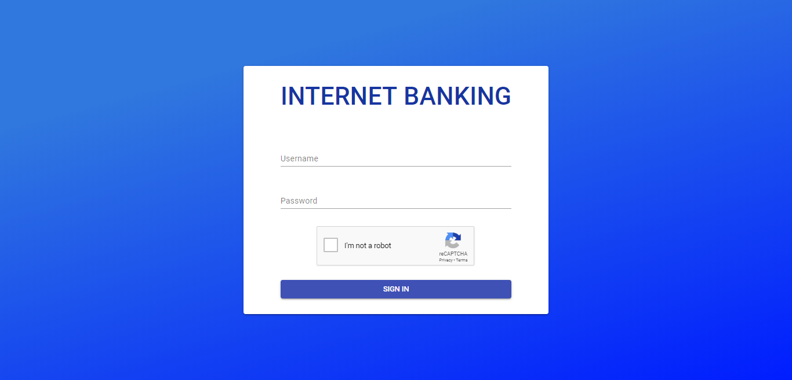

# Subject: Web Development 2
Project's mark: 8.5/10
# Project name: CNM-DACK-InternetBanking-038-051-100
This is a school project for banking management system, using Nodejs as back-end server and Reactjs as front end framework
# Techniques
1. SPA (Frontend)
* reactjs
* react-router
* redux
2. Backend
* RESTful

# Script SQL
folder sql/banking.sql

# Login account
1. Staff
* username: staff
* password: 123
2. Client
* username: client
* password: 123

# Demo
Login

Staff

Client

